# KOReader Plugins

> ⚠️ **Stability notice** — Tested on **Kobo** devices running KOReader. Other devices (Kindle, PocketBook, Android) may work but are untested.

A collection of 70 game and utility plugins for [KOReader](https://koreader.rocks/).

**→ Full documentation: [docs/README.md](docs/README.md)**

---

## Screenshots

<sub>A sample of 14 plugins — see each plugin's own repo for more.</sub>

<table>
<tr>
<td align="center" width="25%"><a href="https://github.com/t2ym5u/2048.koplugin">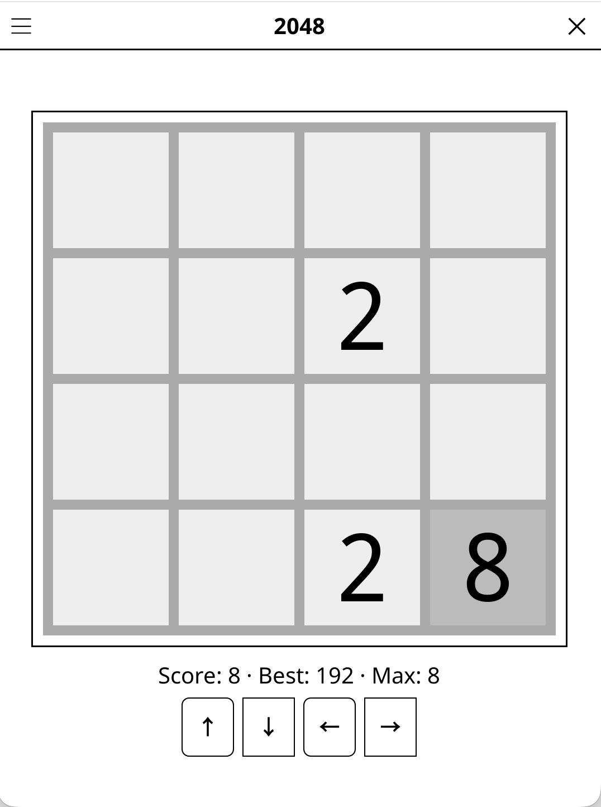</a><br><sub>2048</sub></td>
<td align="center" width="25%"><a href="https://github.com/t2ym5u/anagram.koplugin">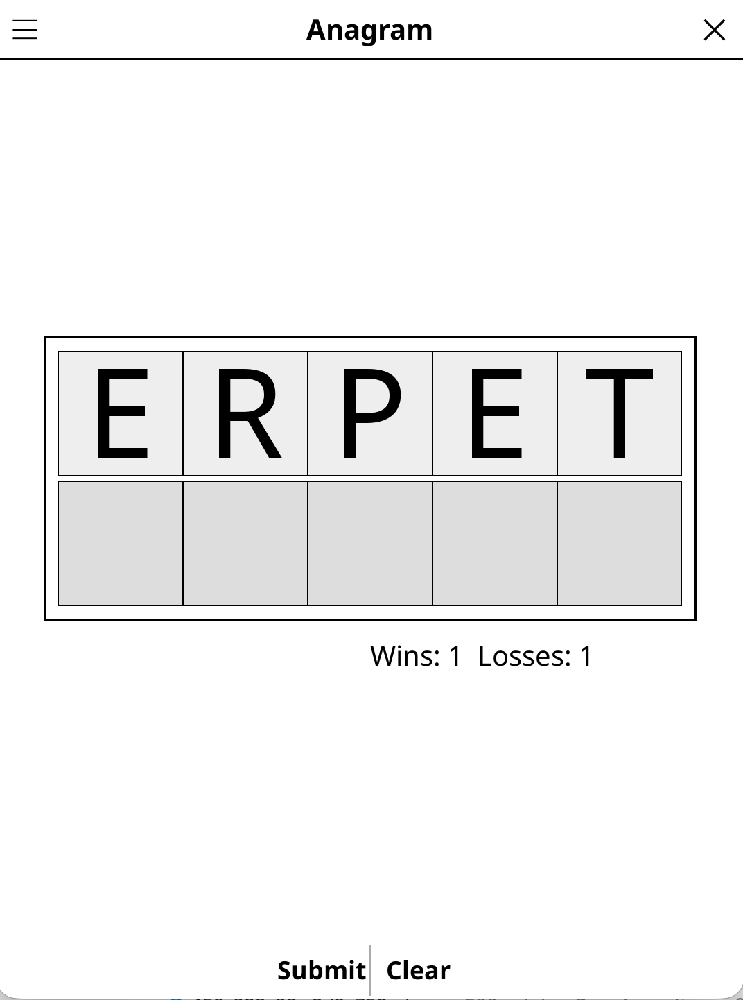</a><br><sub>Anagram</sub></td>
<td align="center" width="25%"><a href="https://github.com/t2ym5u/arrowsudoku.koplugin">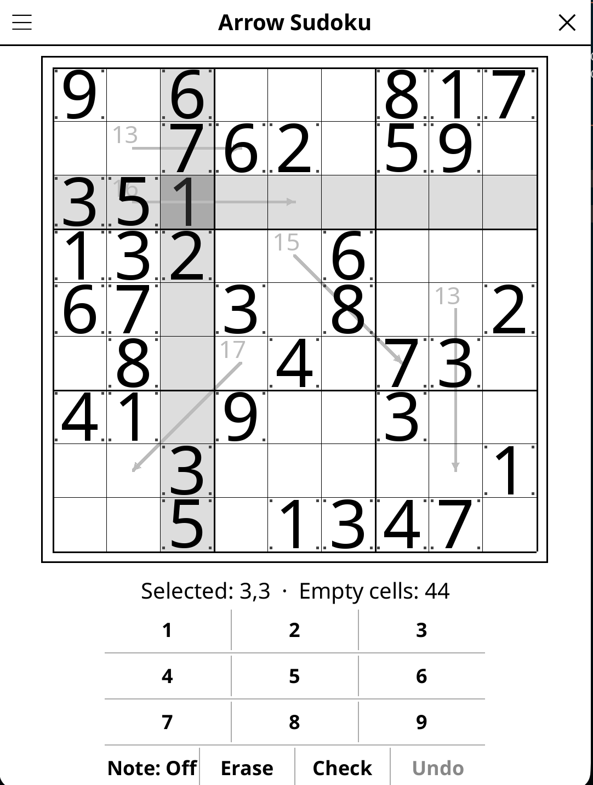</a><br><sub>Arrow Sudoku</sub></td>
<td align="center" width="25%"><a href="https://github.com/t2ym5u/betweenlines.koplugin">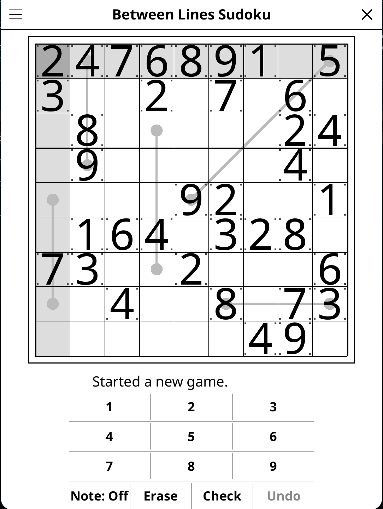</a><br><sub>Between Lines Sudoku</sub></td>
</tr>
<tr>
<td align="center"><a href="https://github.com/t2ym5u/binairo.koplugin">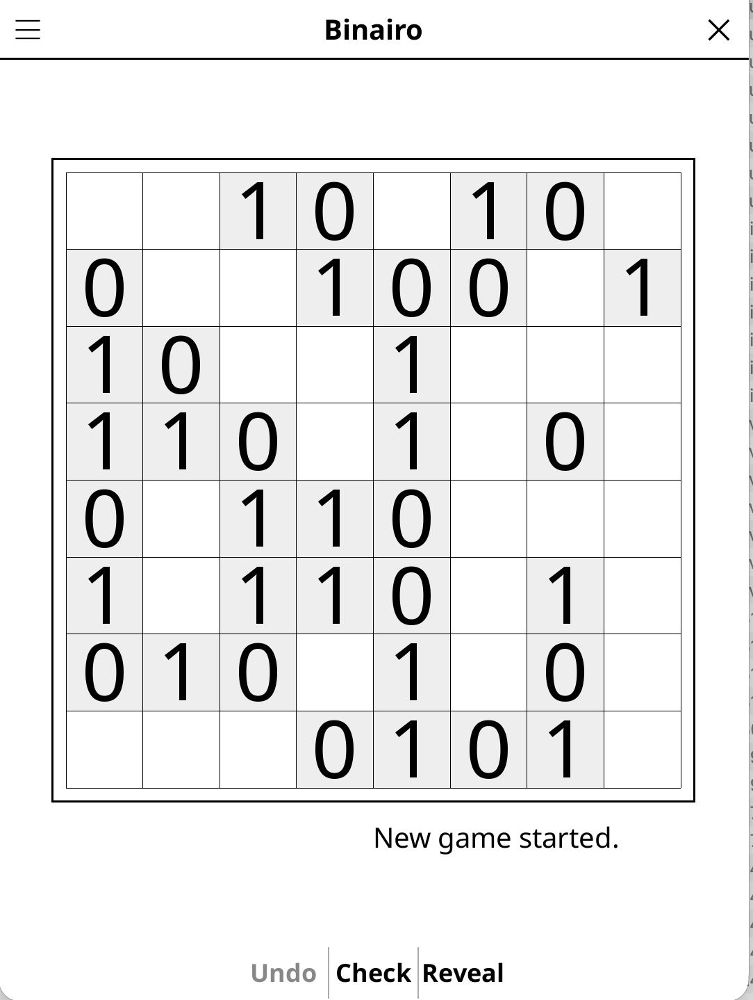</a><br><sub>Binairo</sub></td>
<td align="center"><a href="https://github.com/t2ym5u/boggleparty.koplugin"></a><br><sub>Boggle Party</sub></td>
<td align="center"><a href="https://github.com/t2ym5u/boggle.koplugin">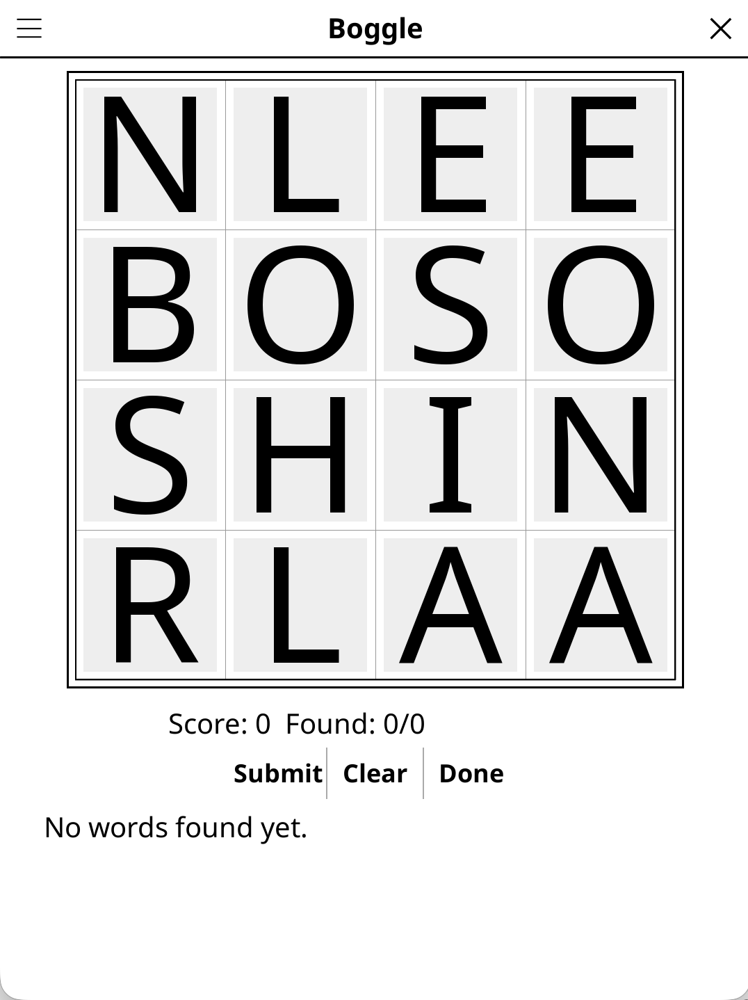</a><br><sub>Boggle</sub></td>
<td align="center"><a href="https://github.com/t2ym5u/bridges.koplugin">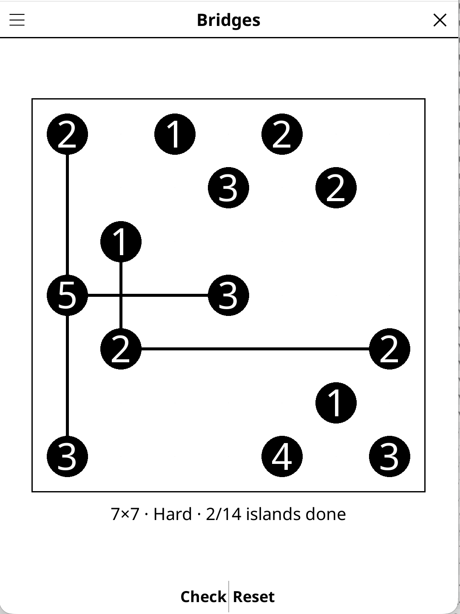</a><br><sub>Bridges</sub></td>
</tr>
<tr>
<td align="center"><a href="https://github.com/t2ym5u/cave.koplugin">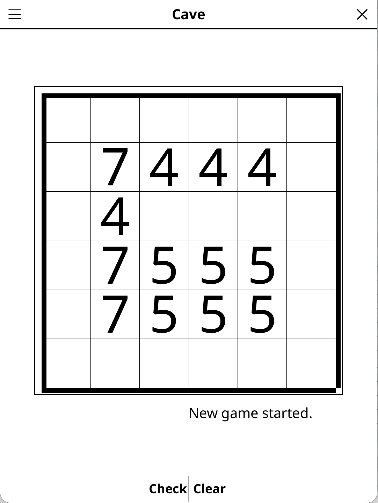</a><br><sub>Cave</sub></td>
<td align="center"><a href="https://github.com/t2ym5u/chess.koplugin">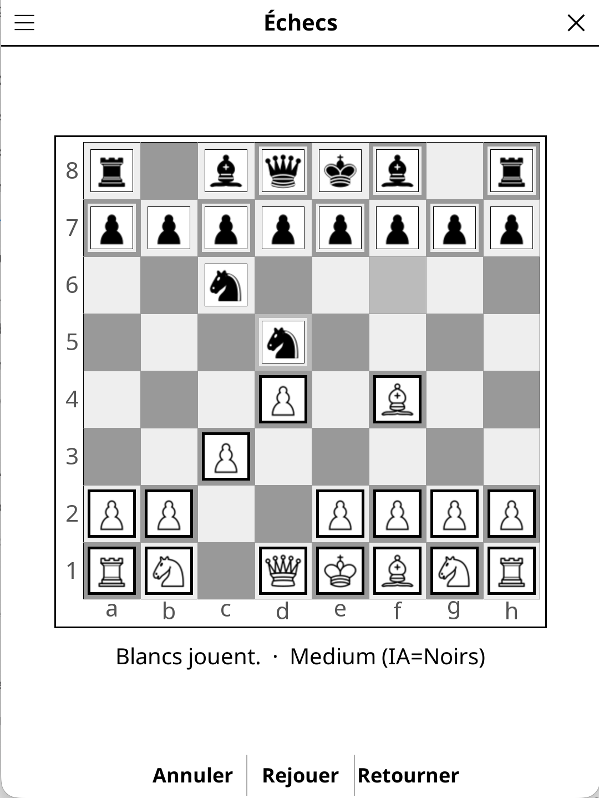</a><br><sub>Échecs</sub></td>
<td align="center"><a href="https://github.com/t2ym5u/fifteen.koplugin">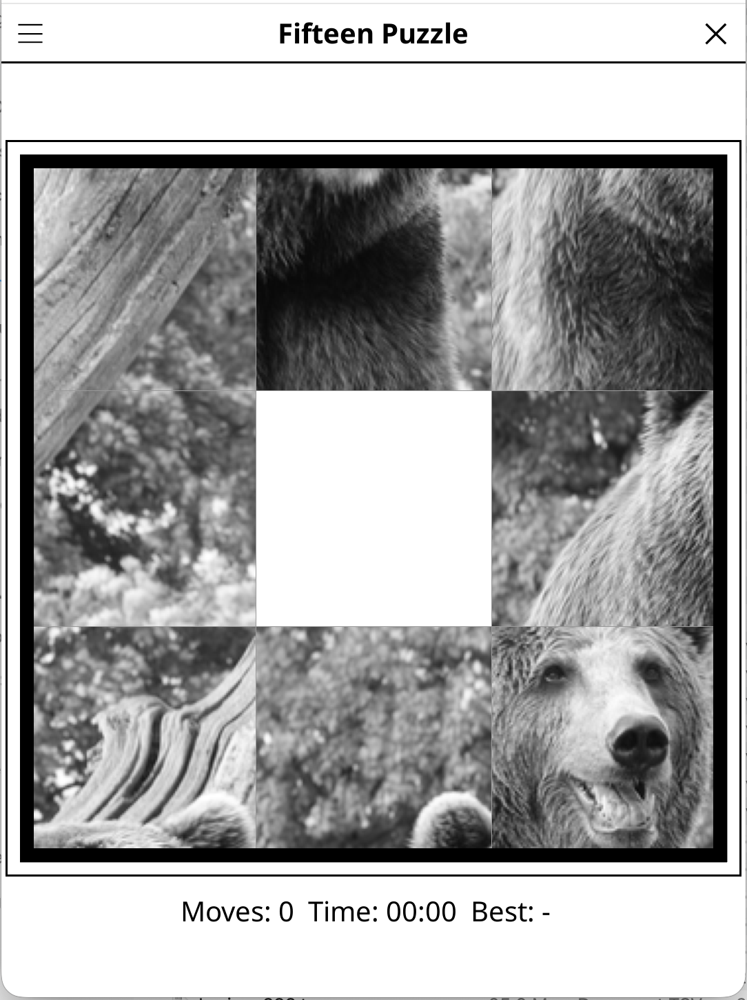</a><br><sub>Fifteen Puzzle</sub></td>
<td align="center"><a href="https://github.com/t2ym5u/fillomino.koplugin"></a><br><sub>Fillomino</sub></td>
</tr>
<tr>
<td align="center"><a href="https://github.com/t2ym5u/futoshiki.koplugin">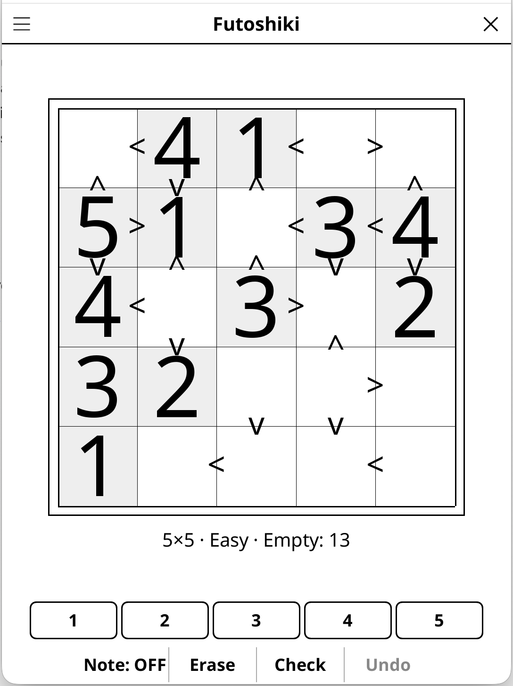</a><br><sub>Futoshiki</sub></td>
<td align="center"><a href="https://github.com/t2ym5u/sudokukiller.koplugin">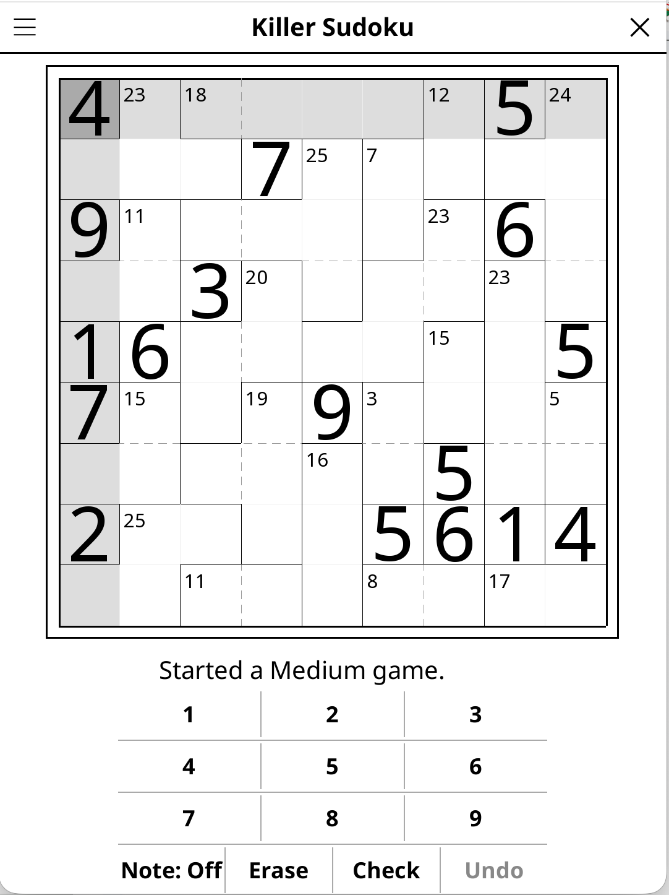</a><br><sub>Sudoku Killer</sub></td>
<td></td>
<td></td>
</tr>
</table>

---

## Quick install

1. Download a plugin zip from [`dist/`](dist/) (or [`koreader-games-full.zip`](dist/koreader-games-full.zip) for everything at once)
2. Extract into your KOReader `plugins/` directory
3. Restart KOReader

Or install the [Plugin Manager](dist/pluginmanager.zip) to browse and update plugins from the device.

## Build

```bash
./scripts/build_release.sh            # build all plugins → dist/
./scripts/build_release.sh fifteen    # build a single plugin
```

## Scripts

| Script | Purpose |
|---|---|
| `scripts/build_release.sh` | Build distributable zips from `manifest.json` |
| `scripts/bump_versions.sh` | Bump versions in all submodules, tag and push |
| `scripts/check_shared_libs.sh` | Check whether game-common/sudoku-common have drifted past `manifest.json` |
| `scripts/check_sudoku_common_drift.sh` | Diff each sudoku-variant's vendored `common/*.lua` against `sudoku-common/` canonical |
| `scripts/link_plugins.sh` | Symlink plugins into a local KOReader install for development |
| `scripts/new_plugin.sh` | Onboard a new plugin: create its GitHub repo, register the submodule, wire up CI |
| `scripts/sync_workflow.sh` | Sync the CI workflow template to all submodules |
| `scripts/sync_community_files.sh` | Sync issue/PR templates + CONTRIBUTING.md to all submodules |
| `scripts/trigger_packages.sh` | Trigger GHCR package publishing on all plugin repos |

## Keeping shared libraries fresh

`game-common` and `sudoku-common` are consumed by most plugins (see
`common_lib` in `manifest.json`), but nothing rebuilds a plugin's zip
automatically when only the shared library changes — release CI (both
per-plugin and this monorepo's) only fires on a plugin's own version bump.
After tagging a new `game-common`/`sudoku-common` release, run:

```bash
./scripts/check_shared_libs.sh   # reports drift, exit 1 if any found
./scripts/bump_versions.sh       # if drift was found, cascade a fresh release
```

## Language support

All plugins auto-detect the KOReader display language (French / English). See [docs/README.md](docs/README.md#-language-support) for details.

## Licence

Each plugin is released under its own licence. See the individual plugin repositories for details.
